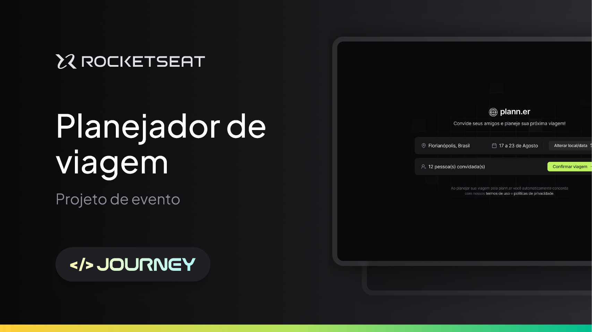

<p align="center">
   
</p>

<p align="center">	
  </a> 
    
  </a>
</p>

> O "Planner" é um site desktop dedicado a facilitar o planejamento de viagens em grupo. Projetado para ser intuitivo e colaborativo, o Planner permite que amigos organizem suas aventuras de maneira eficiente e detalhada, desenvolvido durante a 16ª Next Level Week @Rocketseat
 
<p align="center">
   
</p>


# Índice

* [Pré-Visualização](#eyes-demo-website)   
* [Tecnologias](#computer-technologies)
* [Funcionalidades](#rocket-features)
* [Setup](#construction_worker-how-to-run)
* [Encontrou algum bug?](#bug-issues)
* [Contribuições](#tada-contributing)
* [Licença](#closed_book-license)

# Pré-visualização
- Você pode acessar a pré-visualização do site aqui: [Website]()

# Tecnologias
- Esse projeto foi desenvolvido usando as seguintes tecnologias:

* [Typescript](https://www.typescriptlang.org/)      
* [React](https://reactjs.org/)      
* [TailWindCSS](https://tailwindcss.com/)       

# Funcionalidades

* Planeje sua viagem
* Defina atividades para datas e horários específicos
* Convide amigos e familiares para a sua viagem
* Salve link's importantes para a sua viagem

# Setup
```bash
# Primeiramente clone esse repositório
$ git clone https://github.com/gustavocozsp/planner.git
```
### 💻 Back-End

```bash
$ cd planner/backend

# Instale as dependências
$ npm install

# Inicie a aplicação
$ npm run dev
```
- Informações API: https://nlw-journey.apidocumentation.com/reference

### 💻 Front-End

```bash
$ cd planner/frontend

# Instale as dependências
$ npm install

# Inicie a aplicação
$ npm run dev
```

# Bug's

Por favor, não hesite em reportar um novo bug com todos os detalhes necessários no nosso repositório [planner](https://github.com/gustavocozsp/planner/issues). Se você já tem uma solução para o problema, ficaríamos felizes em analisar seu pull request!

# Informações

Feio com amor por: [Gustavo](https://www.linkedin.com/in/gustavocozsp/)

Este projeto está sob a [licença MIT](./LICENSE).

Publicação no Linkedin durante a Next Level Week e o desenvolvimento desse projeto: [Aqui](https://www.linkedin.com/feed/update/urn:li:activity:7216450489347895296/)


- Caso você tenha gostado do projeto ou ele tenha te ajudo de alguma forma me dê uma ⭐ nesse projto, muito obrigado!
